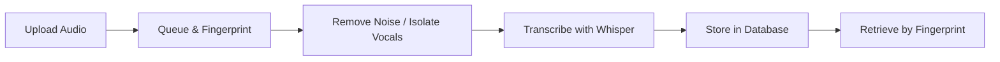

<p align="center">
  
</p>
<h1 align="center">WatESez</h1>

<p align="center">
  <strong>Extract lyrics from any audio file, automatically.</strong>
</p>

<p align="center">
  
  
  
</p>

## What is WatESez?

WatESez is a FastAPI service that takes an audio file and gives you back the lyrics. You upload a song, and it handles everything behind the scenes:  isolating the vocals, transcribing them to text, and saving the result so you can grab it anytime later.

It also generates an acoustic fingerprint for every track you upload. That means if you send the same song twice, it'll recognize it and skip the work. No wasted processing.

## How It Works



Here's what happens step by step:

1. You send an audio file to `POST /lyrics/register`. It gets queued up right away and you get a `202 Accepted` back instantly. No waiting around.
2. An acoustic fingerprint is generated using `fpcalc` (Chromaprint) and hashed with SHA-256. This is how WatESez knows if it's seen this song before.
3. The instrumental gets stripped out with `audio-separator`, leaving only the vocals.
4. `faster-whisper` listens to those isolated vocals and transcribes them into time-stamped lyrics, with language detection included.
5. Everything gets saved to PostgreSQL. You can pull the lyrics back anytime with `GET /lyrics/{fingerprint}`.

A background worker handles the queue asynchronously, so the API stays snappy even when multiple files are processing at once.

## Getting Started

### What You Need

- Python 3.13 or newer
- A running PostgreSQL instance
- `fpcalc` (Chromaprint) installed on your system
- FFmpeg in your PATH

### Installation

1. Clone the repo

   ```bash
   git clone https://github.com/your-username/WatESez.git
   cd WatESez
   ```

2. Install dependencies

   This project uses [uv](https://docs.astral.sh/uv/) to manage packages.

   ```bash
   uv sync
   ```

3. Set up your config

   Check `app/configs/settings.py` for the available settings. You'll want to point it at your PostgreSQL database at minimum.

4. Run migrations

   ```bash
   alembic upgrade head
   ```

5. Start the server

   ```bash
   uv run python -m app.main
   ```

   The API runs on `http://localhost:8000`. You can also check out the interactive docs at `/docs`.

### Try It Out

Register an audio file:

```bash
curl -X POST http://localhost:8000/lyrics/register \
  -F "file=@mysong.mp3"
```

Grab the lyrics once processing is done:

```bash
curl http://localhost:8000/lyrics/{fingerprint}
```

## Docker

A fully dockerized setup with PostgreSQL, FFmpeg, and fpcalc all pre-configured is planned. Just not quite ready yet.

## Tech Stack

| Component      | Technology           |
| -------------- | -------------------- |
| Framework      | FastAPI              |
| Database       | PostgreSQL + SQLAlchemy |
| Migrations     | Alembic              |
| Noise Removal  | audio-separator      |
| Speech-to-Text | faster-whisper       |
| Fingerprinting | Chromaprint (fpcalc) |
| Package Manager| uv                   |

## License

MIT
